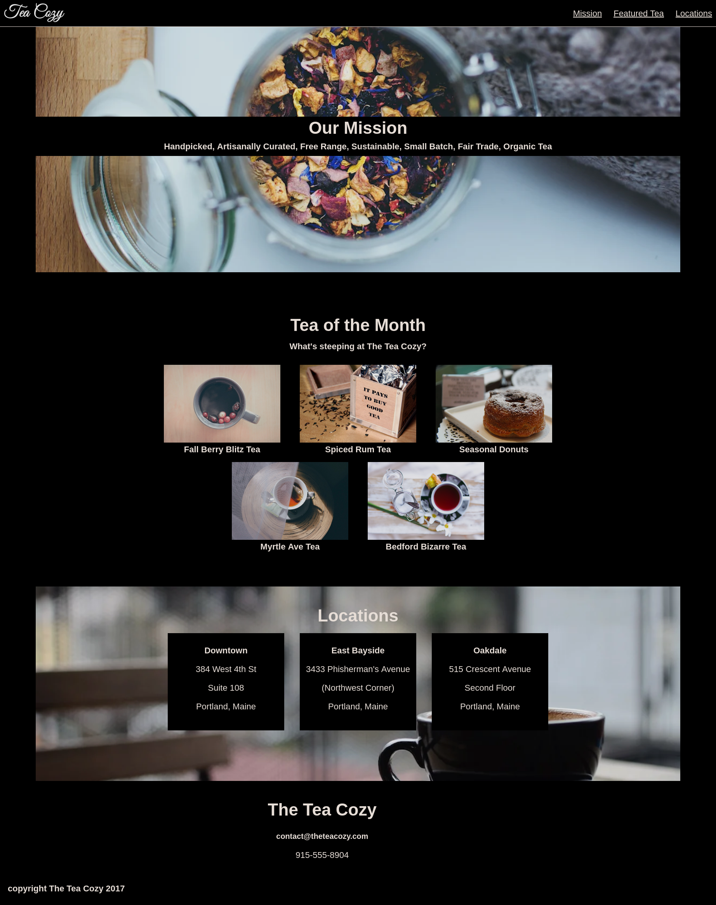

# Tea-cozy - Practice Project

## Description

In this project I created a fictional website for a tea shop. 
This project and all the image assets are provided by Codecademy, from the Front-End Engineer career path. 
They provide the design spec and the image assets to help along the way. Everything else is done entirely by me. 
This web page it's not yet fully responsive so viewing it on mobile may cause layout issues.

### Challenges that I encountered

In this project I had to practice flexbox and although, I know the teory of how it works, 
I still had difficulties to layout everything according to the specs that I was giving 
and making the layout responsive on smaller sizes.

## Screenshots

## Technologies used

1. HTML
2. CSS
3. GIT/GITHUB
4. VSCODE

## Credits

Codecademy - Front-End Engineer Career Path 
<https://www.codecademy.com/>
